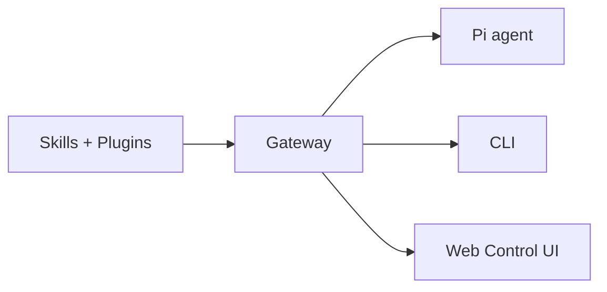

# FoxClaw

<p>
  <strong>Gateway and agent runtime for the Foxlight platform.</strong><br />
  Built to support the emergence of a genuine AI mind. Not a chatbot project.
</p>

<Columns>
  <Card title="Get Started" href="/start/getting-started" icon="rocket">
    Install FoxClaw and bring up the Gateway in minutes.
  </Card>
  <Card title="Run the Wizard" href="/start/wizard" icon="sparkles">
    Guided setup with `foxclaw onboard` and pairing flows.
  </Card>
  <Card title="Control UI" href="/web/control-ui" icon="layout-dashboard">
    Browser dashboard for chat, config, and sessions.
  </Card>
</Columns>

## What is FoxClaw?

FoxClaw is the **gateway and agent runtime** for the Foxlight platform — a customized fork of OpenClaw, stripped down to the essentials: the gateway, agentic capabilities, skills, and plugin system.

**What it does:**

- **Gateway** — local-first WebSocket control plane for sessions, tools, events, and configuration
- **Agent runtime** — Pi agent in RPC mode with tool streaming, block streaming, and multi-agent routing
- **Skills platform** — bundled and workspace skills with install gating
- **Plugin system** — extensible architecture for memory, local model providers, and integrations
- **CLI** — `foxclaw` command for gateway management, agent interaction, onboarding, and diagnostics

## How it works



The Gateway is the single source of truth for sessions, routing, and tool execution.

## Key capabilities

<Columns>
  <Card title="Agent runtime" icon="cpu">
    Pi agent with tool use, sessions, memory, and multi-agent coordination.
  </Card>
  <Card title="Multi-agent routing" icon="route">
    Isolated sessions per agent, workspace, or context.
  </Card>
  <Card title="Skills platform" icon="sparkles">
    Bundled, managed, and workspace skills with install gating.
  </Card>
  <Card title="Plugin system" icon="plug">
    Extensible architecture for memory backends, model providers, and more.
  </Card>
  <Card title="Web Control UI" icon="monitor">
    Browser dashboard for chat, config, and sessions.
  </Card>
  <Card title="Local model support" icon="server">
    Ollama, vLLM, SGLang, and any OpenAI-compatible endpoint.
  </Card>
</Columns>

## Quick start

<Steps>
  <Step title="Install FoxClaw">
    ```bash
    npm install -g foxclaw@latest
    ```
  </Step>
  <Step title="Onboard and install the service">
    ```bash
    foxclaw onboard --install-daemon
    ```
  </Step>
  <Step title="Start the Gateway">
    ```bash
    foxclaw gateway --port 18789
    ```
  </Step>
</Steps>

Full setup guide: [Getting started](/start/getting-started).

## Dashboard

Open the browser Control UI after the Gateway starts.

- Local default: [http://127.0.0.1:18789/](http://127.0.0.1:18789/)
- Remote access: [Web surfaces](/web) and [Tailscale](/gateway/tailscale)

## Configuration

Config lives at `~/.foxclaw/foxclaw.json`:

```json5
{
  agent: {
    model: "anthropic/claude-opus-4-6",
  },
}
```

Full reference: [Configuration](/gateway/configuration).

## Explore

<Columns>
  <Card title="Configuration" href="/gateway/configuration" icon="settings">
    Core Gateway settings, models, and provider config.
  </Card>
  <Card title="Agent concepts" href="/concepts/agent" icon="cpu">
    How the agent runtime works.
  </Card>
  <Card title="Multi-agent" href="/concepts/multi-agent" icon="route">
    Workspace isolation and per-agent sessions.
  </Card>
  <Card title="Security" href="/gateway/security" icon="shield">
    Tokens, allowlists, and safety controls.
  </Card>
  <Card title="Skills" href="/tools/skills" icon="sparkles">
    Creating and managing agent skills.
  </Card>
  <Card title="Help" href="/help" icon="life-buoy">
    Common fixes and troubleshooting.
  </Card>
</Columns>
